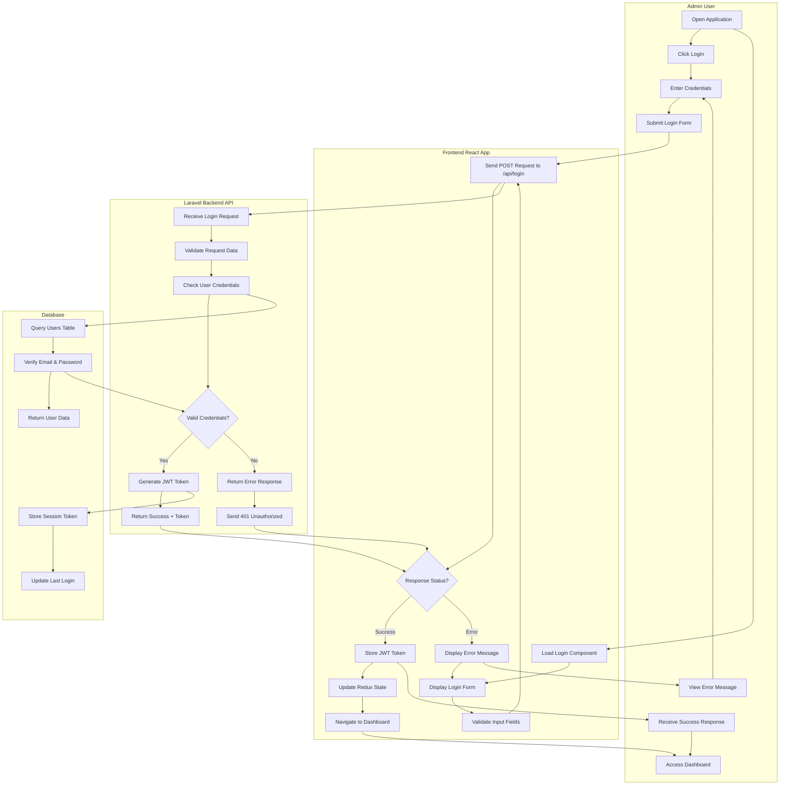

# Smart Dine POS - Swimlane Diagrams

## 🏊‍♂️ Complete System Swimlane Diagrams

### **1. Authentication & Login Process**



---

### **2. Menu Management Process**

```mermaid
graph TD
    subgraph "Admin User"
        A1[Navigate to Menu] --> A2[View Menu Items]
        A2 --> A3{Action Required?}
        A3 -->|Add Item| A4[Click Add New Item]
        A3 -->|Edit Item| A5[Click Edit Button]
        A3 -->|Delete Item| A6[Click Delete Button]
        A4 --> A7[Fill Item Form]
        A7 --> A8[Upload Image Optional]
        A8 --> A9[Submit New Item]
        A5 --> A10[Modify Existing Data]
        A10 --> A11[Save Changes]
        A6 --> A12[Confirm Delete]
        A12 --> A13[Item Removed]
        A9 --> A14[View Updated Menu]
        A11 --> A14
        A13 --> A14
    end
    
    subgraph "Frontend React App"
        F1[Load Menu Component] --> F2[Fetch Menu Items GET /api/menu-items]
        F2 --> F3[Display Items in Grid/List]
        F3 --> F4{User Action?}
        F4 -->|Add| F5[Show Add Form Modal]
        F4 -->|Edit| F6[Show Edit Form Modal]
        F4 -->|Delete| F7[Show Confirm Dialog]
        F5 --> F8[Validate Form Data]
        F8 --> F9[POST /api/menu-items]
        F6 --> F10[Prefill Form with Data]
        F10 --> F11[PUT /api/menu-items/{id}]
        F7 --> F12[DELETE /api/menu-items/{id}]
        F9 --> F13[Update Local State]
        F11 --> F13
        F12 --> F13
        F13 --> F14[Refresh Menu Display]
    end
    
    subgraph "Laravel Backend API"
        B1[Menu Controller] --> B2{Route Method?}
        B2 -->|GET| B3[Index Method - Get All Items]
        B2 -->|POST| B4[Store Method - Create New]
        B2 -->|PUT| B5[Update Method - Modify Existing]
        B2 -->|DELETE| B6[Destroy Method - Remove Item]
        B3 --> B7[Return Menu Items JSON]
        B4 --> B8[Validate Input Data]
        B8 --> B9[Create New Menu Item]
        B5 --> B10[Validate Update Data]
        B10 --> B11[Update Existing Item]
        B6 --> B12[Find & Delete Item]
        B9 --> B13[Return Created Item]
        B11 --> B14[Return Updated Item]
        B12 --> B15[Return Success Response]
    end
    
    subgraph "Database"
        D1[menu_items Table] --> D2{Query Type?}
        D2 -->|SELECT| D3[Fetch All Menu Items]
        D2 -->|INSERT| D4[Create New Item Record]
        D2 -->|UPDATE| D5[Modify Item Record]
        D2 -->|DELETE| D6[Remove Item Record]
        D3 --> D7[Return Items Collection]
        D4 --> D8[Return New Item ID]
        D5 --> D9[Return Updated Record]
        D6 --> D10[Confirm Deletion]
    end
    
    %% Connections
    A1 --> F1
    A4 --> F5
    A5 --> F6
    A6 --> F7
    A9 --> F9
    A11 --> F11
    A12 --> F12
    F2 --> B1
    F9 --> B1
    F11 --> B1
    F12 --> B1
    B3 --> D1
    B4 --> D1
    B5 --> D1
    B6 --> D1
    B7 --> F3
    B13 --> F13
    B14 --> F13
    B15 --> F13
    F14 --> A2
```

---

### **3. Order Management Process**

```mermaid
graph TD
    subgraph "Admin User"
        A1[Navigate to Orders] --> A2[View Orders List]
        A2 --> A3{Action Required?}
        A3 -->|New Order| A4[Click Add New Order]
        A3 -->|Update Status| A5[Change Order Status]
        A3 -->|View Details| A6[Click Order Details]
        A4 --> A7[Enter Customer Info]
        A7 --> A8[Select Menu Items]
        A8 --> A9[Set Quantities]
        A9 --> A10[Add Instructions]
        A10 --> A11[Submit Order]
        A5 --> A12[Select New Status]
        A12 --> A13[Confirm Status Change]
        A6 --> A14[View Full Order Details]
        A11 --> A15[View Updated Orders]
        A13 --> A15
    end
    
    subgraph "Frontend React App"
        F1[Load Orders Component] --> F2[Fetch Orders GET /api/orders]
        F2 --> F3[Display Orders in Table]
        F3 --> F4{User Action?}
        F4 -->|Create| F5[Show Add Order Modal]
        F4 -->|Update| F6[Show Status Update Form]
        F4 -->|View| F7[Show Order Details Modal]
        F5 --> F8[Fetch Menu Items for Selection]
        F8 --> F9[Build Order Object]
        F9 --> F10[POST /api/orders]
        F6 --> F11[PUT /api/orders/{id}]
        F7 --> F12[GET /api/orders/{id}]
        F10 --> F13[Update Orders List State]
        F11 --> F13
        F12 --> F14[Display Order Details]
        F13 --> F15[Refresh Orders Display]
    end
    
    subgraph "Laravel Backend API"
        B1[Order Controller] --> B2{Route Action?}
        B2 -->|Index| B3[Get All Orders]
        B2 -->|Store| B4[Create New Order]
        B2 -->|Show| B5[Get Single Order]
        B2 -->|Update| B6[Update Order Status]
        B3 --> B7[Query Orders with Relations]
        B4 --> B8[Validate Order Data]
        B8 --> B9[Create Order & Order Items]
        B5 --> B10[Find Order by ID]
        B6 --> B11[Update Order Status]
        B7 --> B12[Return Orders Collection]
        B9 --> B13[Return Created Order]
        B10 --> B14[Return Order Details]
        B11 --> B15[Return Updated Order]
    end
    
    subgraph "Database"
        D1[orders Table] --> D2{Query Type?}
        D2 -->|SELECT| D3[Fetch Orders with Items]
        D2 -->|INSERT| D4[Create Order Record]
        D2 -->|UPDATE| D5[Update Order Status]
        D3 --> D6[Join order_items Table]
        D4 --> D7[Create Related Order Items]
        D5 --> D8[Update Timestamps]
        D6 --> D9[Return Complete Orders]
        D7 --> D10[Return New Order ID]
        D8 --> D11[Return Updated Order]
    end
    
    %% Connections
    A1 --> F1
    A4 --> F5
    A5 --> F6
    A6 --> F7
    A11 --> F10
    A13 --> F11
    F2 --> B1
    F10 --> B1
    F11 --> B1
    F12 --> B1
    B3 --> D1
    B4 --> D1
    B6 --> D1
    B12 --> F3
    B13 --> F13
    B15 --> F13
    F15 --> A2
```

---

### **4. Billing & Payment Process**

```mermaid
graph TD
    subgraph "Admin User"
        A1[Navigate to Billing] --> A2[View Bills List]
        A2 --> A3{Action Required?}
        A3 -->|Generate Bill| A4[Select Completed Order]
        A3 -->|Process Payment| A5[Click Process Payment]
        A3 -->|Print Receipt| A6[Click Print Receipt]
        A4 --> A7[Review Order Details]
        A7 --> A8[Confirm Bill Generation]
        A5 --> A9[Select Payment Method]
        A9 --> A10[Enter Payment Details]
        A10 --> A11[Process Payment]
        A6 --> A12[Generate Receipt PDF]
        A12 --> A13[Print Receipt]
        A8 --> A14[View Generated Bill]
        A11 --> A14
        A13 --> A14
    end
    
    subgraph "Frontend React App"
        F1[Load Billing Component] --> F2[Fetch Bills GET /api/bills]
        F2 --> F3[Fetch Completed Orders]
        F3 --> F4[Display Bills & Orders]
        F4 --> F5{User Action?}
        F5 -->|Generate| F6[Show Bill Generation Form]
        F5 -->|Payment| F7[Show Payment Modal]
        F5 -->|Receipt| F8[Generate Receipt PDF]
        F6 --> F9[Calculate Totals & Taxes]
        F9 --> F10[POST /api/bills]
        F7 --> F11[Validate Payment Data]
        F11 --> F12[POST /api/bills/{id}/payment]
        F8 --> F13[POST /api/bills/{id}/mark-printed]
        F10 --> F14[Update Bills State]
        F12 --> F14
        F13 --> F14
        F14 --> F15[Refresh Bills Display]
    end
    
    subgraph "Laravel Backend API"
        B1[Bill Controller] --> B2{Route Action?}
        B2 -->|Index| B3[Get All Bills]
        B2 -->|Store| B4[Create New Bill]
        B2 -->|Process Payment| B5[Process Payment Method]
        B2 -->|Mark Printed| B6[Update Print Status]
        B3 --> B7[Query Bills with Relations]
        B4 --> B8[Calculate Bill Totals]
        B8 --> B9[Create Bill Record]
        B5 --> B10[Validate Payment Data]
        B10 --> B11[Update Payment Status]
        B6 --> B12[Mark as Printed]
        B7 --> B13[Return Bills Collection]
        B9 --> B14[Return Created Bill]
        B11 --> B15[Return Payment Confirmation]
        B12 --> B16[Return Print Confirmation]
    end
    
    subgraph "Database"
        D1[bills Table] --> D2{Operation Type?}
        D2 -->|SELECT| D3[Fetch Bills with Orders]
        D2 -->|INSERT| D4[Create Bill Record]
        D2 -->|UPDATE Payment| D5[Update Payment Status]
        D2 -->|UPDATE Print| D6[Update Print Status]
        D3 --> D7[Join orders & order_items]
        D4 --> D8[Calculate & Store Totals]
        D5 --> D9[Update Payment Fields]
        D6 --> D10[Update Printed Timestamp]
        D7 --> D11[Return Complete Bill Data]
        D8 --> D12[Return New Bill ID]
        D9 --> D13[Return Updated Payment]
        D10 --> D14[Return Print Status]
    end
    
    %% Connections
    A1 --> F1
    A4 --> F6
    A5 --> F7
    A6 --> F8
    A8 --> F10
    A11 --> F12
    A13 --> F13
    F2 --> B1
    F10 --> B1
    F12 --> B1
    F13 --> B1
    B3 --> D1
    B4 --> D1
    B5 --> D1
    B6 --> D1
    B13 --> F4
    B14 --> F14
    B15 --> F14
    B16 --> F14
    F15 --> A2
```

---

### **5. Inventory Management Process**

```mermaid
graph TD
    subgraph "Admin User"
        A1[Navigate to Inventory] --> A2[View Inventory List]
        A2 --> A3{Action Required?}
        A3 -->|Add Item| A4[Click Add New Item]
        A3 -->|Adjust Stock| A5[Click Adjust Stock]
        A3 -->|Check Alerts| A6[View Low Stock Alerts]
        A4 --> A7[Fill Item Details Form]
        A7 --> A8[Set Initial Quantities]
        A8 --> A9[Submit New Item]
        A5 --> A10[Enter Adjustment Reason]
        A10 --> A11[Enter New Quantity]
        A11 --> A12[Submit Adjustment]
        A6 --> A13[Review Alert Items]
        A13 --> A14[Mark Alerts as Seen]
        A9 --> A15[View Updated Inventory]
        A12 --> A15
        A14 --> A15
    end
    
    subgraph "Frontend React App"
        F1[Load Inventory Component] --> F2[Fetch Inventory GET /api/inventory]
        F2 --> F3[Fetch Alerts GET /api/inventory-alerts]
        F3 --> F4[Display Inventory & Alerts]
        F4 --> F5{User Action?}
        F5 -->|Add| F6[Show Add Item Form]
        F5 -->|Adjust| F7[Show Stock Adjustment Form]
        F5 -->|Alerts| F8[Show Alerts Panel]
        F6 --> F9[Validate Item Data]
        F9 --> F10[POST /api/inventory]
        F7 --> F11[Validate Adjustment Data]
        F11 --> F12[POST /api/inventory/{id}/adjust-stock]
        F8 --> F13[Display Alert Details]
        F10 --> F14[Update Inventory State]
        F12 --> F14
        F13 --> F15[Mark Alerts as Read]
        F14 --> F16[Refresh Inventory Display]
    end
    
    subgraph "Laravel Backend API"
        B1[Inventory Controller] --> B2{Route Action?}
        B2 -->|Index| B3[Get All Inventory Items]
        B2 -->|Store| B4[Create New Inventory Item]
        B2 -->|Adjust Stock| B5[Adjust Stock Levels]
        B2 -->|Alerts| B6[Get Low Stock Alerts]
        B3 --> B7[Query Inventory with Statistics]
        B4 --> B8[Validate Inventory Data]
        B8 --> B9[Create Inventory Record]
        B5 --> B10[Validate Adjustment Data]
        B10 --> B11[Update Stock Quantity]
        B6 --> B12[Query Low Stock Items]
        B7 --> B13[Return Inventory Collection]
        B9 --> B14[Return Created Item]
        B11 --> B15[Return Updated Item]
        B12 --> B16[Return Alert Items]
    end
    
    subgraph "Database"
        D1[inventory Table] --> D2{Operation Type?}
        D2 -->|SELECT| D3[Fetch Inventory Items]
        D2 -->|INSERT| D4[Create New Item]
        D2 -->|UPDATE| D5[Update Stock Quantity]
        D2 -->|LOW STOCK| D6[Query Items Below Minimum]
        D3 --> D7[Calculate Current Values]
        D4 --> D8[Set Initial Stock Levels]
        D5 --> D9[Update Quantity & Timestamp]
        D6 --> D10[Filter by min_quantity Threshold]
        D7 --> D11[Return Inventory Data]
        D8 --> D12[Return New Item ID]
        D9 --> D13[Return Updated Stock]
        D10 --> D14[Return Alert Items]
    end
    
    %% Connections
    A1 --> F1
    A4 --> F6
    A5 --> F7
    A6 --> F8
    A9 --> F10
    A12 --> F12
    F2 --> B1
    F3 --> B1
    F10 --> B1
    F12 --> B1
    B3 --> D1
    B4 --> D1
    B5 --> D1
    B6 --> D1
    B13 --> F4
    B14 --> F14
    B15 --> F14
    B16 --> F8
    F16 --> A2
```

---

### **6. Analytics & Reporting Process**

```mermaid
graph TD
    subgraph "Admin User"
        A1[Navigate to Analytics] --> A2[View Dashboard Metrics]
        A2 --> A3{Report Type?}
        A3 -->|Sales Report| A4[Select Date Range]
        A3 -->|Popular Items| A5[View Top Selling Items]
        A3 -->|Export Data| A6[Choose Export Format]
        A4 --> A7[Generate Sales Report]
        A7 --> A8[View Report Charts]
        A5 --> A9[Analyze Item Performance]
        A6 --> A10[Select PDF/CSV/Excel]
        A10 --> A11[Download Export File]
        A8 --> A12[Print/Share Report]
        A9 --> A12
        A11 --> A12
    end
    
    subgraph "Frontend React App"
        F1[Load Analytics Component] --> F2[Fetch Dashboard Stats]
        F2 --> F3[GET /api/simple-analytics/dashboard-stats]
        F3 --> F4[Display Metrics Dashboard]
        F4 --> F5{User Action?}
        F5 -->|Sales| F6[Show Date Range Selector]
        F5 -->|Items| F7[Fetch Popular Items Data]
        F5 -->|Export| F8[Show Export Options Modal]
        F6 --> F9[Generate Sales Report Request]
        F7 --> F10[GET /api/simple-analytics/menu-report]
        F8 --> F11[Select Export Format & Range]
        F9 --> F12[Create Charts with Recharts]
        F10 --> F13[Display Items Analysis]
        F11 --> F14[POST /api/analytics/export/{format}]
        F12 --> F15[Display Interactive Charts]
        F13 --> F15
        F14 --> F16[Download Generated File]
    end
    
    subgraph "Laravel Backend API"
        B1[Analytics Controller] --> B2{Report Type?}
        B2 -->|Dashboard| B3[Get Dashboard Statistics]
        B2 -->|Sales| B4[Generate Sales Report]
        B2 -->|Menu| B5[Generate Menu Analysis]
        B2 -->|Export| B6[Generate Export File]
        B3 --> B7[Calculate Daily Metrics]
        B4 --> B8[Query Sales Data by Range]
        B5 --> B9[Analyze Menu Item Performance]
        B6 --> B10[Format Data for Export]
        B7 --> B11[Return Dashboard JSON]
        B8 --> B12[Return Sales Report Data]
        B9 --> B13[Return Menu Analysis]
        B10 --> B14[Return File Download Response]
    end
    
    subgraph "Database"
        D1[Multiple Tables Join] --> D2{Data Source?}
        D2 -->|Orders| D3[Query orders & order_items]
        D2 -->|Bills| D4[Query bills & payments]
        D2 -->|Inventory| D5[Query inventory levels]
        D3 --> D6[Calculate Sales Metrics]
        D4 --> D7[Calculate Revenue Data]
        D5 --> D8[Calculate Stock Analytics]
        D6 --> D9[Group by Date/Period]
        D7 --> D10[Sum Revenue by Method]
        D8 --> D11[Calculate Turnover Rates]
        D9 --> D12[Return Sales Analytics]
        D10 --> D13[Return Revenue Analytics]
        D11 --> D14[Return Inventory Analytics]
    end
    
    %% Connections
    A1 --> F1
    A4 --> F6
    A5 --> F7
    A6 --> F8
    A7 --> F9
    A10 --> F11
    F2 --> B1
    F9 --> B1
    F10 --> B1
    F14 --> B1
    B3 --> D1
    B4 --> D1
    B5 --> D1
    B11 --> F4
    B12 --> F12
    B13 --> F13
    B14 --> F16
    F15 --> A2
    F16 --> A11
```

---

## 🔄 Swimlane Summary

### **Key Interactions Between Layers:**

1. **User Layer**: Admin performs actions through intuitive UI
2. **Frontend Layer**: React components handle state, validation, and API calls
3. **Backend Layer**: Laravel controllers process requests and business logic
4. **Database Layer**: Persistent data storage and retrieval operations

### **Data Flow Patterns:**

- **Read Operations**: User → Frontend → API → Database → API → Frontend → User
- **Write Operations**: User Input → Frontend Validation → API Processing → Database Update → Response → Frontend Update → User Feedback
- **Error Handling**: Error Detection → Error Response → Frontend Display → User Retry Option

### **Security Flow:**

- JWT Token authentication at API level
- Input validation in both frontend and backend
- Database-level constraints and relationships
- Secure session management throughout the stack

These swimlane diagrams show the complete interaction flow between all system components for each major POS operation in your simplified admin-only restaurant management system.